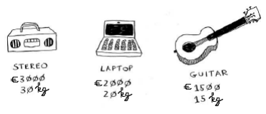
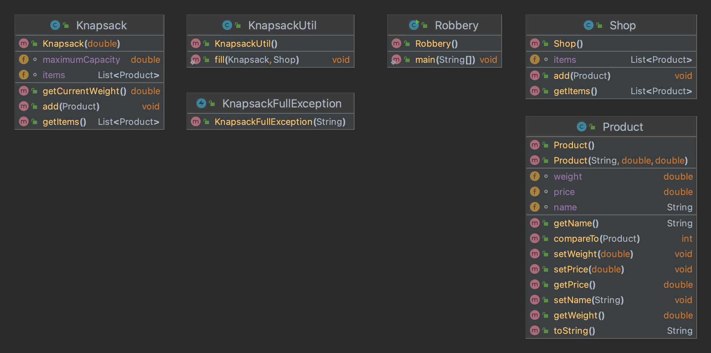
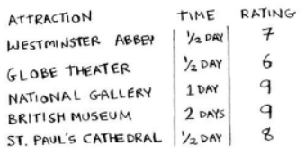
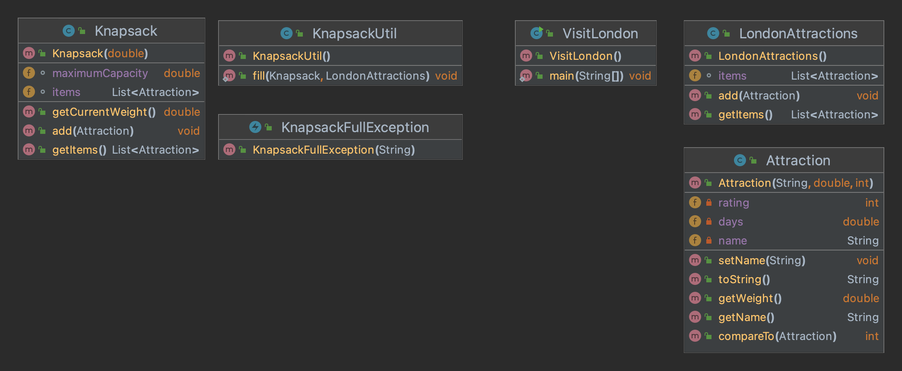
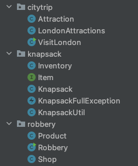

# Generics exercise - The knapsack problem - greedy algorithm

## Part 1 : Use case Robbery
A thief goes out at night to rob a store.
In the store are 3 products. However, the thief can only take what fits in his backpack. The backpack can carry 35kg.
We are going to help the thief decide which items he will put in the backpack.
We will implement a greedy algorithm.
This is a simple algorithm:

1. Take the most expensive item that still fits in the backpack.
2. Take the next most expensive item that fits.
3. And so on ...



The backpack can carry 35kg of goods, so we suggest stealing the stereo.
After stealing the stereo, there is no room for additional items.
The greedy algorithm will not provide an optimal solution.
Had we allowed the theft of the laptop and the guitar, then the backpack would be full and we would have a total value of €3500 instead of €3000.
The greedy algorithm solves our problem well, though not perfect.


### KnapsackFullException.java
Implement this checked exception. Add a constructor with one parameter for the error message.

### Product.java
A product has 3 properties: name (String), weight (double), and price (double).
- Provide a constructor with 3 parameters.
- Provide getters and setters.
- Provide a meaningful toString() method.

Ensure that a product can be compared/sorted based on its price.
This can be done by implementing the **Comparable&lt;T&gt;** interface.
- A negative value is obtained if the price of the “this” object is greater than the price of the specified parameter.
- A positive value is given when the price of “this” object is less than the price of the specified parameter.
- The result is 0 if the prices of both objects are equal.

### ProductTest.java
Implement unit tests for the method compareTo().

### Knapsack.java
This class represents a backpack with a maximum capacity.
In the constructor, you specify the maximumCapacity of the Knapsack.
Provide a method getCurrentWeight() to request the sum of the weights of all elements in the Knapsack.
Use streams and lambda expressions.
Provide an add() method to add an element. If adding the given element exceeds the maximumCapacity of the Knapsack, throw a KnapsackFullException with a clear message and ensure that the element does not end up in the Knapsack.
Finally, provide a method getItems() to retrieve all elements from the Knapsack.

### KnapsackTest.java
Write unit tests for the method getCurrentWeight().  
Write unit tests for the method add().

### KnapsackUtil.java
This class is responsible for the greedy algorithm.
The class contains 1 static method fill() with 2 parameters: a knapsack and a list of products.
In the fill() method, all products are first sorted (use a method from the Collections class for this!).
Then you try to add these sorted products one by one to the knapsack.

### Robbery.java (main)
This main-class is available. 
Expected output:
```
Cannot add product [laptop]. Maximum capacity reached.
Cannot add product [guitar]. Maximum capacity reached.

List of products:
Product{name='stereo', weight=30.0, price=3000.0}
Product{name='watch', weight=1.0, price=850.5}
```
Add extra products in the shop and change the capacity of the backpack.

### EXTRA: KnapsackUtilTest.java
Write unit tests for the method fill().

### Classdiagram


___

## Part 2 : Use case Citytrip

Suppose you go to London for the weekend. There's a lot to do, but unfortunately you only have two days. 
We have a list of attractions that can be visited. The greedy algorithm will decide on the attractions to visit in London.



### Attraction.java
An Attraction has 3 properties: name, time (double), and rating (int).
- Provide a constructor with 3 parameters.
- Provide getters and setters.
- Provide a meaningful toString() method.
- Ensure that an attraction can be compared/sorted based on its rating.

The compareTo() method is implemented based on the rating of an attraction.
- A negative value is obtained if the rating of the "this" object is greater than the rating of the given parameter.
- A positive value is given when the rating of the "this" object is smaller than the rating of the given parameter.
- The result is 0 if the ratings of both objects are equal.

The getWeight() method returns the time you allocate for an attraction.

### AttractionTest.java
Write unit tests for the method compareTo().

### Knapsack.java
This class represents the citytrip with a maximum number of days.
In the constructor, you pass the maximumCapacity (=max days) of the Knapsack.
Provide a method getCurrentWeight() to request the sum of the weights of all elements in the Knapsack.
Provide a method add() to add an element. If adding the given element exceeds the maximumCapacity of the Knapsack, throw a KnapsackFullException and ensure that the element does not end up in the Knapsack.
Finally, provide a method getItems() to request all elements from the Knapsack.

### KnapsackUtil.java
This class is responsible for the greedy algorithm.
The class contains a static method fill() with 2 parameters: a knapsack and a list of attractions in London.
In the fill() method, all attractions from the inventory are first sorted (use a method from the Collections class for this!).
Then, you try to add the elements of this sorted list one by one to the Knapsack.

### VisitLondon.java (main)
This main-class is available.
Expected output:
```
Cannot add attraction [Westminster Abbey]. Maximum capacity reached.
Cannot add attraction [National Gallery]. Maximum capacity reached.
Cannot add attraction [Globe Theater]. Maximum capacity reached.

List of attractions:
Attraction{name='British Museum', days=1.5, rating=9}
Attraction{name='St. Paul's Cathedral', days=0.5, rating=8}
```
Add additional attractions or extend your stay in London.

### Classdiagram


___

## Part 3 : Refactor
Refactor the Knapsack classes into a separate knapsack package and make 
them generic so they can be used for both use cases.

### Tips
- Attraction and Product are both items with a "weight"
- Shop and LondonAttractions are both inventories of items with a weight

- Desired class structure

- 

